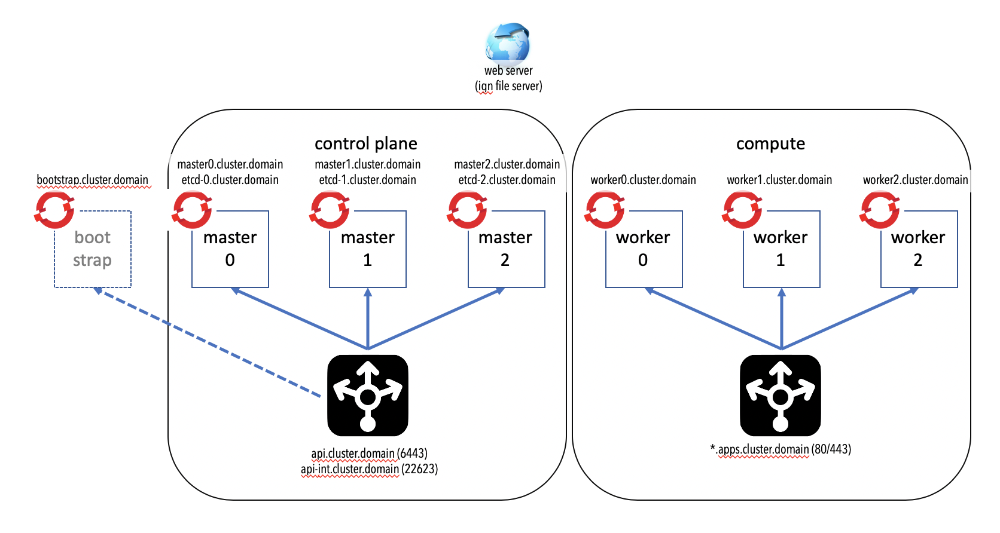
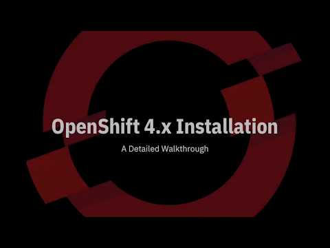

# Debugging OpenShift 4.x installation

To be able to successfully debug installation OpenShift 4.x you must:

- Understand how ssh works using private keys
- Understand DNS processing and potentially DHCP
- Understand the OpenShift initialization and bootstrap process

## Openshift architecture

OpenShift 4.x contains the following major building block

An OpenShift cluster contains

- The control plane which hosts the master nodes and the control plane load balancer
- The compute nodes which contains the worker nodes and the application load balancer

In addition, the web server and bootstrap node is used in the installation process to initialize the cluster.
Depending on your configuration and how you provision worker nodes, you may or may not need the Web server in the operation of the cluster. You definitely does not need the bootstrap node after the cluster installation is completed.

The control plane load balancer is used to serve the cluster API endpoint and the cluster machine config API endpoint. The application load balancer is used to serve the application routes in the cluster.

## OpenShift installation process

The following describes the OpenShift installation process:

1. Installation preparation - these must be checked prior to installation when you are performing custom User Provisioned Infrastructure. If you are using Installation Provisioned Infrastructure or automated using terraform, a lot of this tasks are automated hence you do not need to check.

    - DNS resolution
    - Load Balancer
    - Installation code and client code
    - Storage for ignition file (object storage, Web server, FTP server)
    - Create ignition files

    [Preparation check](preparation.md)

2. Cluster initialization

    This short video demonstrate on how a cluster is initialized.

    

    1. Bootstrap node startup

        - Getting ignition file and boot coreOS
        - Loading release image
        - Initialize bootkube service
        - Loop - waiting for etcd cluster
        - Loop - waiting for critical Kubernetes pods in masters
        - Complete bootkube service

        [Bootstrap check](bootstrap.md)

    2. Master nodes startup

        - Getting ignition file (from bootstrap) and boot coreOS
        - Startup etcd service
        - Startup kubelet and processing etcd content
        - Initialize machine configuration operator
        - Create cluster operators and initialize cluster

        [Master check](master.md)

    3. Worker nodes startup

        - Getting ignition file (from master machine config operator) and boot coreOS
        - Startup kubelet
        - Set up ingress controller and router
        - Finish processing of cluster operators

        [Worker check](worker.md)
