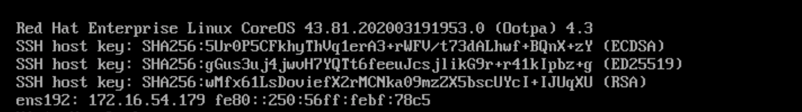
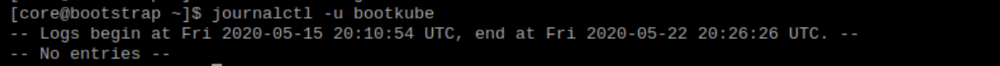
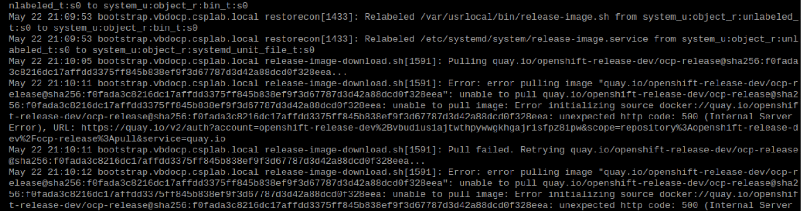
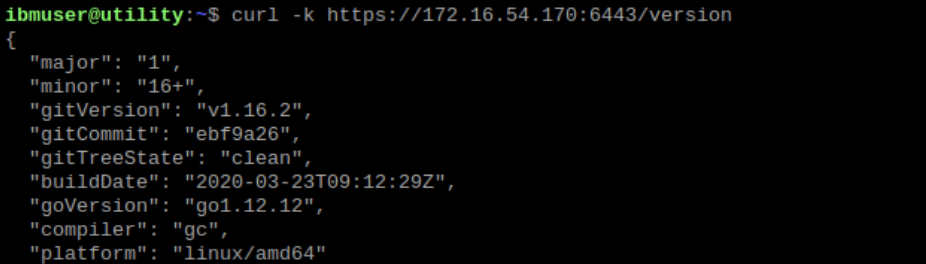
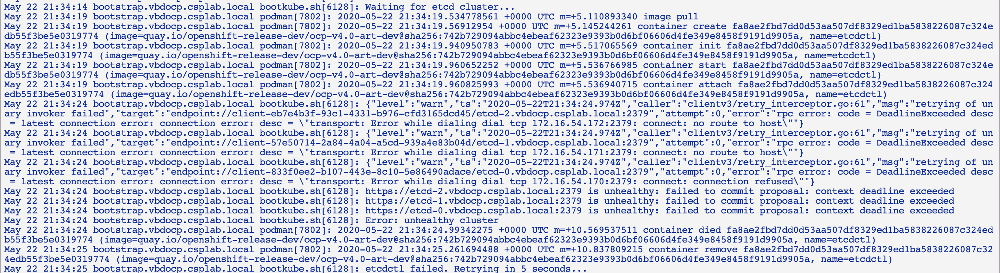
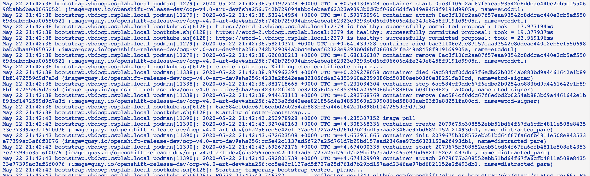
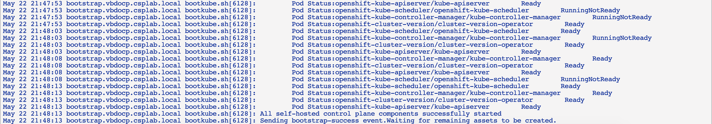
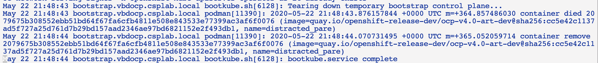

# Bootstrap troubleshooting

You now have verified the infrastructure and boot up the nodes. The first node to initialize is the bootstrap node.

## Bootstrap initialization

The bootstrap machine initialization is performed by reading ignition files. There are several ways that this may fail. The first thing to check is whether the login page is displayed in the bootstrap machine console. If it got to the console, that means that the ignition initialization is complete. You can then progress to the next section, otherwise here are some reason that may cause the initialization failed:

- Bootstrap coreOS image is invalid, this get back to the method on how you initialize or boot the coreOS, there are currently several mechanism that you can employ to do this (and I *do* recommend that you use the same method for the bootstrap, masters and workers nodes):

    - from virtual appliance image (and attach the ignition in the user data field)
    - from a PXE boot server (the PXE image must be implemented with the same architecture as your VM) - debugging PXE boot is out of scope here
    - from a CD installation image and loading image from a Web server (this allows you to specify a static IP)
        the following boot option specifies a static IP (ip address: 192.168.1.120, hostname: master0, default route: 192.168.1.1 and DNS server: 192.168.1.188):
        ```
        coreos.inst.install_dev=sda
        coreos.inst.image_url=http://WEBSERVER/install/rhcos-4.1.0-x86_64-metal-bios.raw.gz
        coreos.inst.ignition_url=http://WEBSERVER/master.ign
        ip=192.168.1.120::192.168.1.1:255.255.255.0:master0.ocp4.example.com:ens192:none nameserver=192.168.1.188

        ```

- Bootstrap server cannot get an IP address from DHCP and no static IP is provided, then the bootstrap server cannot initialize TCP stack to get the ignition file. DHCP debugging out of scope here.

- Bootstrap ignition injection is invalid, typical vApp option is in base64. Copy the content there and check: `echo -n "<vapp option>" | base64 -d > boot.ign` and perform a diff to the actual ignition file `diff boot.ign bootstrap.ign` make sure that looks ok.  It may also caused by the bootstrap ignition is too long, so you use a wrapper. Other possibility is that the vApp format is not specified as `base64`.

- Bootstrap node cannot access the ignition file - this can be anything from a typo in the URL or the URL itself is not accessible. Try running `curl http://webserver/bootstrap.ign` to check whether you can get the file. The URL must be specified in `ignition.config.append.0.source path` that URL must be specified correctly there without any other delimiters.

## Bootstrap is running

Now that you see the bootstrap login screen in the console. The first thing to verify is the IP address of the server, whether it confirms to the hostname table that you have. If it does not match, the rest of the process wont work, you must resolve the IP address assignment first. Some environment use MAC address to resolve IP address for DHCP. Or you can also use CD boot and specify a static IP address. <br>  

You can SSH into the bootstrap node using your private SSH key (`~/.ssh/id_rsa`) or extract the key from your automation platform that you use to generate the SSH key. Remember that the SSH public key is the one that you put in the `install-config.yaml` file (typically `~/.ssh/id_rsa.pub`). If you extract the key from something like `terraform.tfstate` file, you can use this vi command to replace the `\n` into a proper new line character: `:%s/\\n/\r/g`.

Login to the bootstrap machine: `ssh -i ~/.ssh/id_rsa core@<bootstrap ip>`. Depending on where you are in the bootstrap process - you can see the following:

- Bootkube.service journal is empty, when you run `journalctl -b -f -u bootkube.service` you did not get data.  This typically means that the bootstrap machine cannot get the OpenShift container images.  Run `journalctl -b | grep release-image | more` and see the failure there some:

    - Cannot access `quay.io`: check internet connectivity and check the pull secret authentication  <br>
    - Cannot access the mirror registry: check the mirror URL is correct, check the file `/etc/containers/registries.json`
    - Authentication failure to access the mirror registry, check custom user is pull secret, check the file `/root/.docker/config.json` and make sure the credential there can be used to login (`sudo podman login`)
    - Cannot start the container (although the image is downloaded successfully) - this is typically caused by installation image and coreOS version mismatch

- The first phase of the bootkube is to initialize the API server - you can check this using the command `curl -k https://<bootstrap>:6443/api/version`  <br> <br> Verify that you can retrieve the same result through the load balancer `curl -k https://api.<cluster>.<base-domain>:6443/api/version` Note that you may have to run this multiple times (4 times?) as the request may be sent in a round robin way to the masters and bootstrap. If you cannot get this, then you should check your master load balancer for port 6443.

- The second phase is initializing the machine config operator, you can check this using the command `curl -k https://<bootstrap>:22623/config`   <br> <br> Verify that you can retrieve the same result through the load balancer `curl -k https://api-int.<cluster>.<base-domain>:22623/config` Note that you may have to run this multiple times (4 times?) as the request may be sent in a round robin way to the masters and bootstrap. If you cannot get this, then you should check your master load balancer for port 22623.

- The bootstrap is moving on to checking etcd cluster from the masters (at this stage the master nodes should be initializing - go to the [master](master.md)) <br> <br>and eventually<br>

- Once the master nodes are running the ETCD cluster the bootstrap is pushing the manifests to the masters and checks whether  critical kubernetes services are `Running` (at this stage the master nodes should be initializing - go to the [master](master.md)) <br>

- At the end you can see bootkube is completed. at this stage you can shutdown and remove your bootstrap node. Remember also to remove the bootstrap node from the load balancer. <br>
