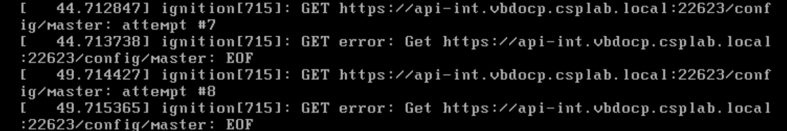
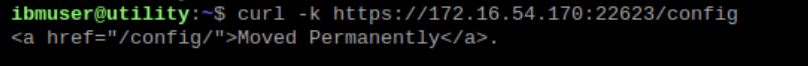
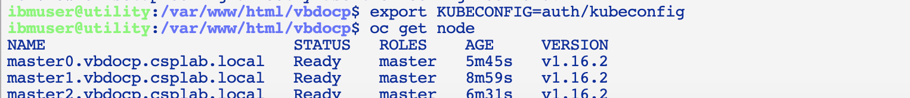
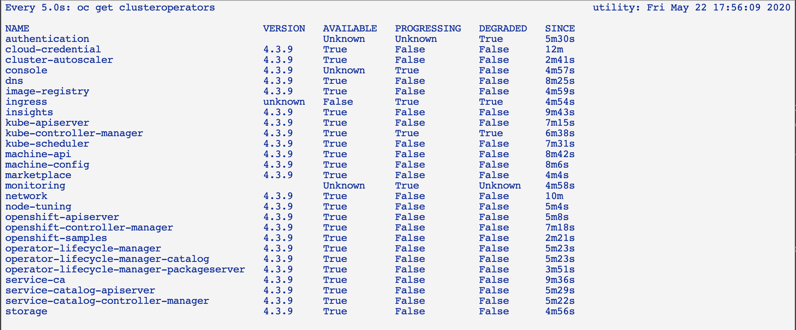

# Master node troubleshooting

Now that you are here - you check the console of the master nodes - similar to the bootstrap node console.

## Master node initialization

Typically if you have your bootstrap on the waiting for ETCD server - your master node has been initialized. If you found that the master is not initialized and you see messages like <br>. It means that it is waiting for the bootstrap to initialize the machine config server. If the bootstrap is checked using the command `curl -k https://<bootstrap>:22623/config`   <br> <br> But the load balancer `curl -k https://api-int.<cluster>.<base-domain>:22623/config` is failed then you should check your master load balancer for port 22623.


## Master is Running

Once the master nodes are running and the bootstrap node has been removed from the master load balancer, most of the checking is performed using `oc` command.

```
export KUBECONFIG=auth/kubeconfig
oc get node
```

This should show the unhealthy master nodes initially and then they become Ready. <br>

After the master nodes are Ready, check the cluster operators. Run `oc get clusteroperators`. You can also run `watch -n5 oc get clusteroperators` that will have the display refreshed every 5 seconds. <br>

Eventually the only ones that are not Ready should be authentication and console. Those 2 clusteroperators requires worker nodes to be running before they becomes Available.

## Problems with masters

The following are some of the potential problems that can arises when installing masters:

- Masters does not have enough computing power (ie CPU, memory, storage) - kubelet will complain on failure to initialize pod; master status never become Ready

- Workers are not provisioned from the cluster (Public cloud platform) = check MachineSet and Machine operator
