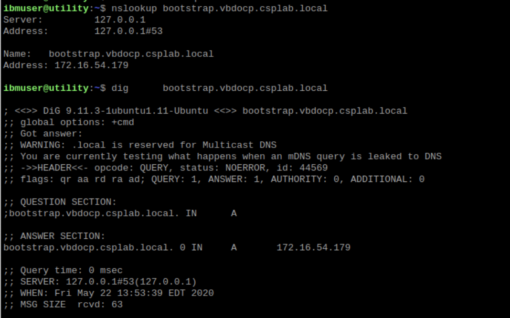
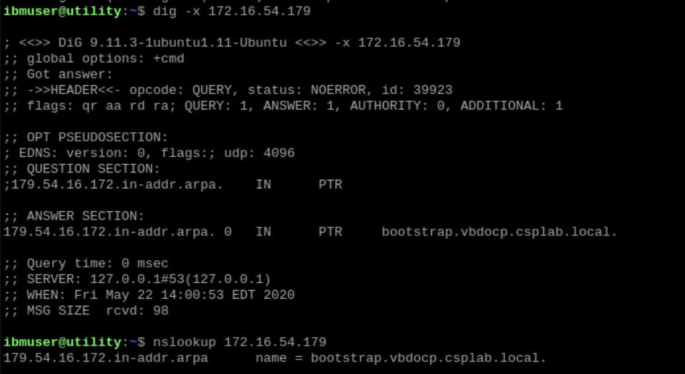
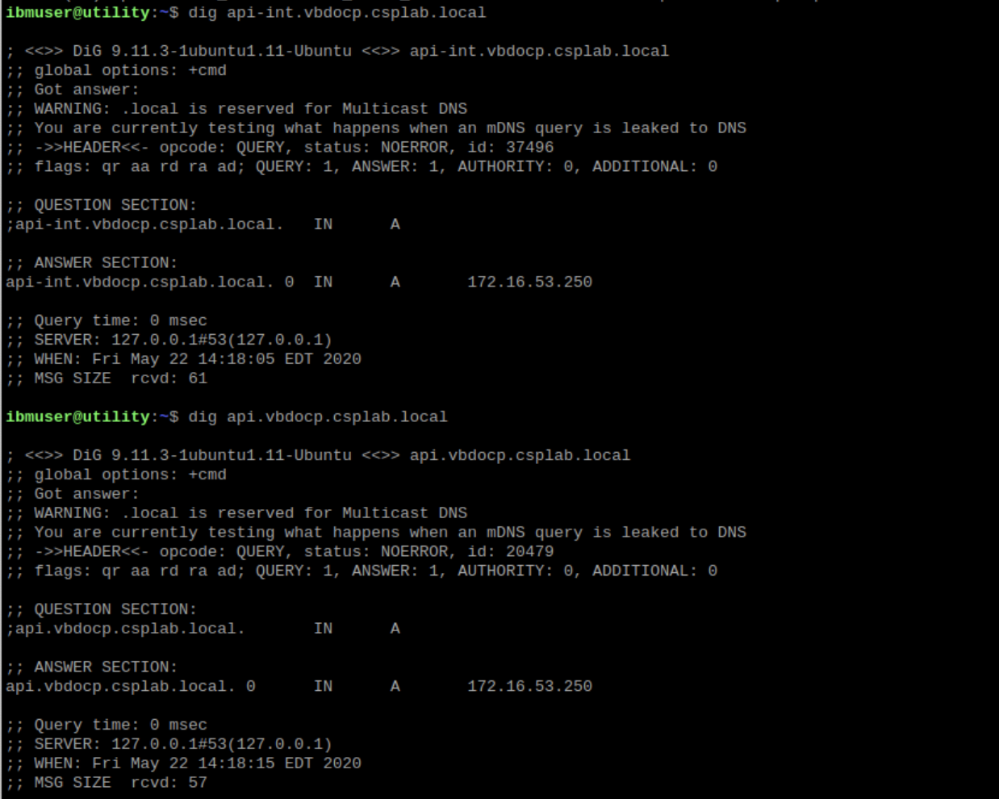
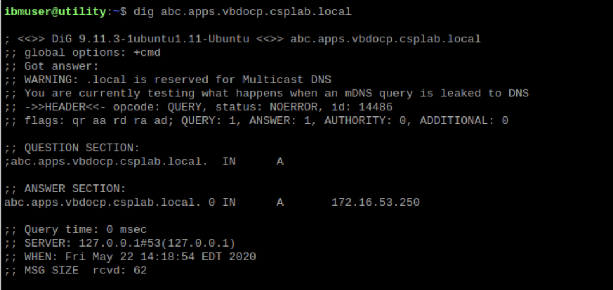
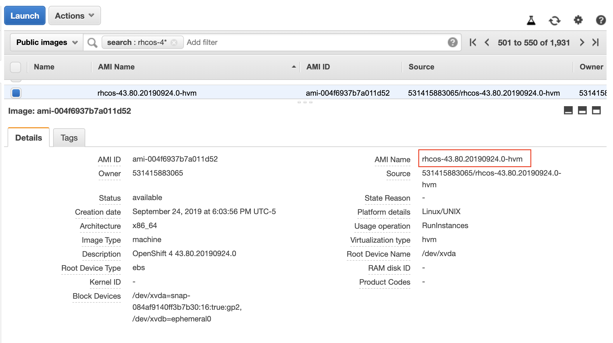

# Check for preparation

## DNS check

OpenShift 4 relies heavily on DNS resolution. So the DNS entries must be correctly setup.

Determine first the information for the cluster

- `base-domain`:  _______________
- `clustername`:  _______________

Your cluster and hostnames would then resides in the sub-domain of `clustername.base-domain`.

+-----------+---------+-----------------------+
| role      | IP addr | Hostname              |
+-----------+---------+-----------------------+
| bootstrap |         |                       |
| master0   |         |                       |
| master1   |         |                       |
| master2   |         |                       |
| worker0   |         |                       |
| worker1   |         |                       |
|           |         |                       |
|           |         |                       |
|           |         |                       |
|           |         |                       |
|           |         |                       |
+-----------+---------+-----------------------+

Check and make sure that you can perform forward and reverse lookup for each entries in the table above:

- Forward lookup: `nslookup <hostname>` or `dig <hostname>` <br> 
- Reverse lookup: `nslookup <ipaddr>` or `dig -x <ipaddr>` <br> 

Also check to make sure that the hostnames of `etcd-n.clustername.base-domain` (where n=0/1/2) can resolve to the master IP addresses:

- Run: `nslookup <hostname>` or `dig <hostname>`

## Load balancer check

Load balancer are required to load balance the master nodes and the worker nodes. Further requirement is that the load balancers must be addressed using specific DNS hostnames. This requirement is hard to test without any backend system ready. But you can perform the following:

- API-INT check: `dig api-int.<clustername>.<base-domain>` this should resolve to your master load balancer
- API check: `dig api.<clustername>.<base-domain>` this should resolve to your master load balancer  <br> 
- APPS check: `dig abc.apps.<clustername>.<base-domain>` this should resolve to your worker load balancer <br> 

Load balancer setting checks:

- Check master forwarding for port 6443 and 22623 - both should be raw TCP mode
- Check worker forwarding for port 80 and 443 - you can use raw TCP mode for both

Further checking will be performed once the cluster is initializing.

## OpenShift code check

The version of the installation code and the coreOS image **MUST** be consistent. The coreOS image and the installation code must have the **SAME** major and minor version; you **cannot** mix and match versions (ie installation code 4.3.x must use coreOS image 4.3.x)

The installation (and client code) can be downloaded from `https://mirror.openshift.com/pub/openshift-v4/clients/ocp/` and the coreOS version can be found in `https://mirror.openshift.com/pub/openshift-v4/dependencies/rhcos/`. Make sure the major and minor versions matches.

*Note*: if you are using images from a public cloud provider, you must make sure that this matches too; the following is an example for AWS AMI on which the image name shows that this image is for coreOS 4.3. <br> 

**Note**: If you are using a mirrored registry - make sure that the installer version matches with the image version that you copied using `oc adm release mirror`.

## Ignition file check

You generate the ignition files from `install-config.yaml` file. You run the commands:

```
openshift-install create manifests --dir=<installdir>
openshift-install create ignition-configs --dir=<installdir>
```

Make sure:

1. The time between you generate the files and the machine boot is less than 20 hours (the generated certificate is only valid for 24 hours and it takes at least 1 hour to initialize the cluster)

2. The ignition files are accessible in the object storage that you choose, so you must copy/move/map the path to the storage and you must allow the storage to serve your file (ie allow at least read access to them). The command `chmod a+x *.ign` may be needed.

3. Ignition file can be chained. You may need a temporary file that refers to the original bootstrap.ign as it may be too large to be passed directly to the coreOS appliance.
