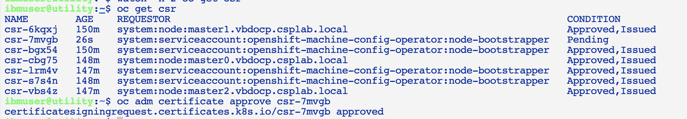
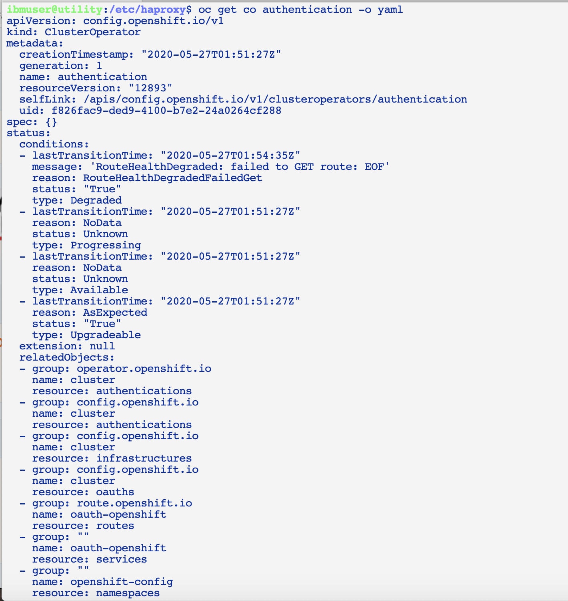
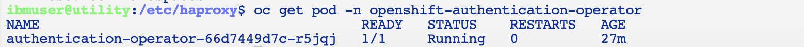
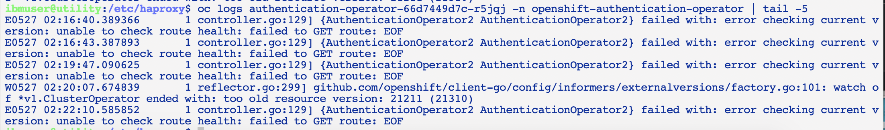
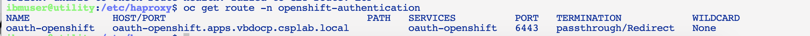
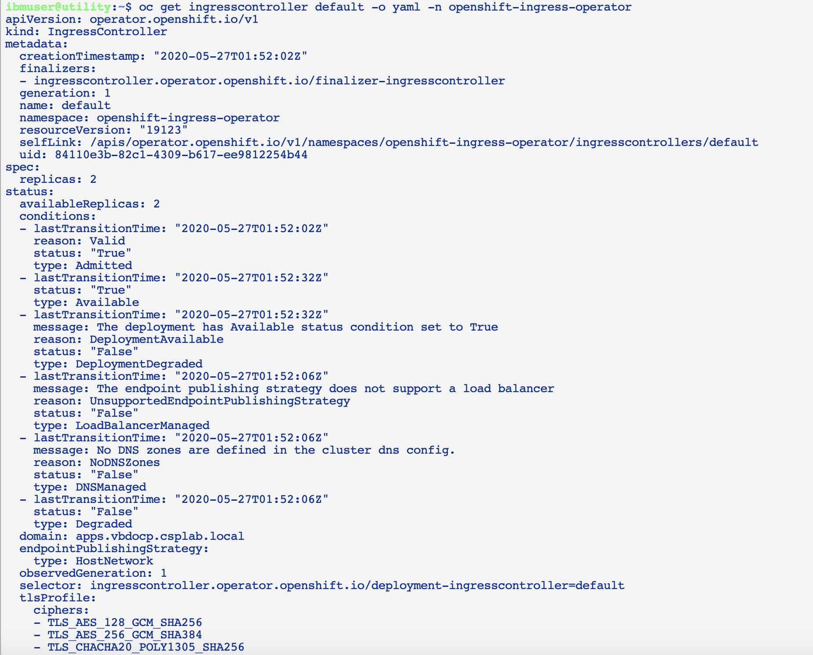
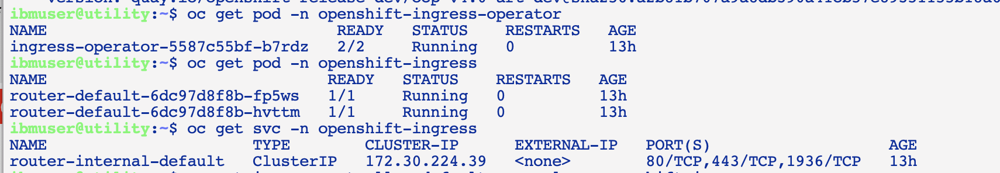
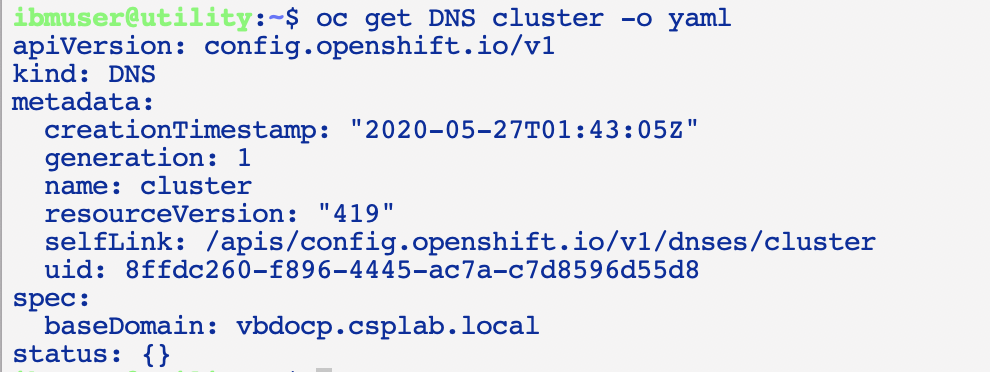
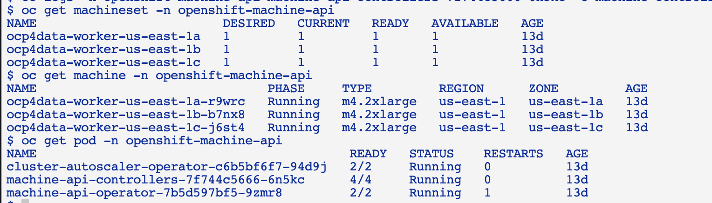

# Worker node

Once you try to work on the worker nodes, typically most of the infrastructure and connectivity problems are ironed out with the bootstrap and master initialization. Hence we assume that at this stage the worker nodes can be booted and the console shown the login page. Otherwise, follow the steps for master not initializing.

Worker nodes are needed to initialize the authentication cluster operator and console cluster operator.

## Pending CSR

Depending on the initialization of the worker, there may be some Certificate Signing Requests (CSRs) that are not automatically approved. You may need to approve them manually - Symptom: worker machines are running, but the node is not created in `oc get node`, kubelet shows unknown node message:

```
May 27 01:38:56 worker0.vbdocp.csplab.local hyperkube[1299]: E0527 01:38:56.334685    1299 kubelet.go:2275] node "worker0.vbdocp.csplab.local" not found
```

Approve csr can be performed by the following command:

`oc adm certificate approve <certname>`

or to approve all Pending csrs:

```
oc get csr | grep Pending | awk '{print $1}' | xargs oc adm certificate approve
```



## Authentication cluster operator

Lets look at more detail on authentication cluster operator (the steps here can also apply to most other cluster operators):

- You can get more detail on cluster operator using the command: `oc get co authentication -o yaml` <br>

- Find pod name(s) from the operator namespace that is shown in the output above, such as `openshift-authentication-operator` <br>

- Look at the operator pod logs to see what is still needed for its completion `oc logs <podname> -n openshift-authentication-operator` <br>

- In the log there, it shows that the operator trying to connect to the route but failed. You can get the route by issuing `oc get route -n openshift-authentication` <br>


## Ingress controller

Ingress controller structure is shown in the following diagram:

- Getting the ingress controller information <br>

    The endpointPublishingStrategy is used to publish the ingress controller endpoints to other networks, enable load balancer integrations, etc. If unset, the default is based on infrastructure.config.openshift.io/cluster.status.platform. For AWS, Azure, GCP and IBMCloud, they are using `LoadBalancerService` (services are loaded as NodePort and load balancer IP distribute); Other platforms are using `HostNetwork` (mapped the port to the node actual port) .

- Getting router information <br> 

- Getting DNS integration information - DNS information are listed as:

    - `baseDomain` is the base domain of the cluster. All managed DNS records will be sub-domains of this base.

    - `privateZone` is the location where all the DNS records that are only available internally to the cluster exist. If this field is nil, no private records should be created. Once set, this field cannot be changed.

    - `publicZone` is the location where all the DNS records that are publicly accessible to the internet exist. If this field is nil, no public records should be created. Once set, this field cannot be changed.

    

## Machine and MachineSet

Now in public cloud provider environment, most of the time worker nodes are provisioned automatically by the cluster using the machine and machineset mechanism. The benefit of this situation is that your environment would allow worker machines to be provisioned as needed, hence allow cluster auto-scaling. But this may result in failure to provision worker nodes without an obvious clue. To work with this feature, use `openshift-machine-api` namespace.

- Check the  machinesets, machines and pods in the openshift-machine-api namespace <br>

- Check the logs in the `machine-api-controller-xxxx` pod container `machine-controller`

    It may have error such as:

    ```
    I0514 15:41:51.290732       1 controller.go:163] ocp4data-worker-us-east-1c-j6st4: reconciling Machine
    I0514 15:41:51.290754       1 actuator.go:489] ocp4data-worker-us-east-1c-j6st4: Checking if machine exists
    I0514 15:41:51.341330       1 actuator.go:502] ocp4data-worker-us-east-1c-j6st4: Instance does not exist
    I0514 15:41:51.341356       1 controller.go:419] ocp4data-worker-us-east-1c-j6st4: going into phase "Provisioning"
    I0514 15:41:51.346993       1 controller.go:307] ocp4data-worker-us-east-1c-j6st4: reconciling machine triggers idempotent create
    I0514 15:41:51.347018       1 actuator.go:106] ocp4data-worker-us-east-1c-j6st4: creating machine
    E0514 15:41:51.347185       1 utils.go:236] NodeRef not found in machine ocp4data-worker-us-east-1c-j6st4
    I0514 15:41:51.380115       1 instances.go:47] No stopped instances found for machine ocp4data-worker-us-east-1c-j6st4
    I0514 15:41:51.380145       1 instances.go:145] Using AMI ami-0839ec38afd3783f2
    I0514 15:41:51.380157       1 instances.go:77] Describing security groups based on filters
    I0514 15:41:51.581587       1 instances.go:122] Describing subnets based on filters
    I0514 15:41:53.035748       1 actuator.go:202] ocp4data-worker-us-east-1c-j6st4: ProviderID set at machine spec: aws:///us-east-1c/i-0b9b51e1e166e251d
    I0514 15:41:53.035866       1 actuator.go:587] ocp4data-worker-us-east-1c-j6st4: Updating status
    I0514 15:41:53.035891       1 actuator.go:615] ocp4data-worker-us-east-1c-j6st4: finished calculating AWS status
    I0514 15:41:53.048152       1 actuator.go:658] ocp4data-worker-us-east-1c-j6st4: Instance state still pending, returning an error to requeue
    W0514 15:41:53.048180       1 controller.go:309] ocp4data-worker-us-east-1c-j6st4: failed to create machine: requeue in: 20s
    ```
Or other types of errors.
